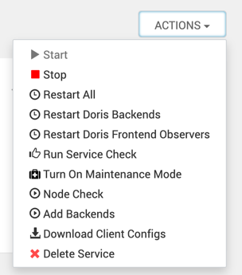
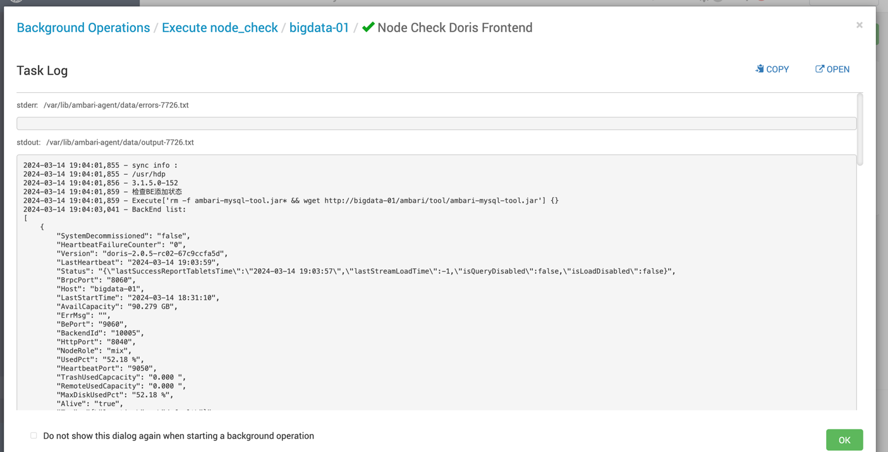

# Ambari Doris 服务集成源码
[toc]

> 注意: .img 目录、README.md、.gitignore 文件非源码文件，做二次开发时将其删掉，避免影响使用
## 节点类型介绍
| 节点类型              | 说明                                                                                                    |
|-------------------|-------------------------------------------------------------------------------------------------------|
| Frontend          | Frontend Master节点,逻辑Master节点，后续负载时可能会转移，数量只能为1，优先启动，后续Frontend Follower会通过该节点的端口添加节点信息。               |
| Frontend Follower | 与Frontend完全相同，单独出来的原因是因为Frontend节点用作首次安装通过MySQL Client添加节点使用。如:`ALTER SYSTEM ADD FOLLOWER 'ip:port';` |
|Frontend Observer| 即Doris Observer节点                                                                                     |
|Backend| 即Doris Backend节点                                                                                      |
|Client|用作客户端下载文件使用，暂无其他作用|

## ACTIONS 中方法介绍

### Node Check
运行该检查会通过MySQL Client调用Frontend的query_port接口，查询现在的Frontend节点和Backend节点状态信息。
运行结果如下

```
2024-03-14 19:04:01,855 - sync info : 
2024-03-14 19:04:01,855 - /usr/hdp
2024-03-14 19:04:01,856 - 3.1.5.0-152
2024-03-14 19:04:01,859 - 检查BE添加状态
2024-03-14 19:04:01,859 - Execute['rm -f ambari-mysql-tool.jar* && wget http://bigdata-01/ambari/tool/ambari-mysql-tool.jar'] {}
2024-03-14 19:04:03,041 - BackEnd list:
[
    {
        "SystemDecommissioned": "false", 
        "HeartbeatFailureCounter": "0", 
        "Version": "doris-2.0.5-rc02-67c9ccfa5d", 
        "LastHeartbeat": "2024-03-14 19:03:59", 
        "Status": "{\"lastSuccessReportTabletsTime\":\"2024-03-14 19:03:57\",\"lastStreamLoadTime\":-1,\"isQueryDisabled\":false,\"isLoadDisabled\":false}", 
        "BrpcPort": "8060", 
        "Host": "bigdata-01", 
        "LastStartTime": "2024-03-14 18:31:10", 
        "AvailCapacity": "90.279 GB", 
        "ErrMsg": "", 
        "BePort": "9060", 
        "BackendId": "10005", 
        "HttpPort": "8040", 
        "NodeRole": "mix", 
        "UsedPct": "52.18 %", 
        "HeartbeatPort": "9050", 
        "TrashUsedCapcacity": "0.000 ", 
        "RemoteUsedCapacity": "0.000 ", 
        "MaxDiskUsedPct": "52.18 %", 
        "Alive": "true", 
        "Tag": "{\"location\" : \"default\"}", 
        "TabletNum": "14", 
        "DataUsedCapacity": "0.000 ", 
        "TotalCapacity": "188.800 GB"
    }, 
    {
        "SystemDecommissioned": "false", 
        "HeartbeatFailureCounter": "0", 
        "Version": "doris-2.0.5-rc02-67c9ccfa5d", 
        "LastHeartbeat": "2024-03-14 19:03:59", 
        "Status": "{\"lastSuccessReportTabletsTime\":\"2024-03-14 19:03:38\",\"lastStreamLoadTime\":-1,\"isQueryDisabled\":false,\"isLoadDisabled\":false}", 
        "BrpcPort": "8060", 
        "Host": "bigdata-02", 
        "LastStartTime": "2024-03-14 18:31:02", 
        "AvailCapacity": "165.968 GB", 
        "ErrMsg": "", 
        "BePort": "9060", 
        "BackendId": "10007", 
        "HttpPort": "8040", 
        "NodeRole": "mix", 
        "UsedPct": "13.44 %", 
        "HeartbeatPort": "9050", 
        "TrashUsedCapcacity": "0.000 ", 
        "RemoteUsedCapacity": "0.000 ", 
        "MaxDiskUsedPct": "13.44 %", 
        "Alive": "true", 
        "Tag": "{\"location\" : \"default\"}", 
        "TabletNum": "14", 
        "DataUsedCapacity": "0.000 ", 
        "TotalCapacity": "191.736 GB"
    }, 
    {
        "SystemDecommissioned": "false", 
        "HeartbeatFailureCounter": "0", 
        "Version": "doris-2.0.5-rc02-67c9ccfa5d", 
        "LastHeartbeat": "2024-03-14 19:03:59", 
        "Status": "{\"lastSuccessReportTabletsTime\":\"2024-03-14 19:03:00\",\"lastStreamLoadTime\":-1,\"isQueryDisabled\":false,\"isLoadDisabled\":false}", 
        "BrpcPort": "8060", 
        "Host": "bigdata-03", 
        "LastStartTime": "2024-03-14 18:31:02", 
        "AvailCapacity": "157.769 GB", 
        "ErrMsg": "", 
        "BePort": "9060", 
        "BackendId": "10006", 
        "HttpPort": "8040", 
        "NodeRole": "mix", 
        "UsedPct": "17.72 %", 
        "HeartbeatPort": "9050", 
        "TrashUsedCapcacity": "0.000 ", 
        "RemoteUsedCapacity": "0.000 ", 
        "MaxDiskUsedPct": "17.72 %", 
        "Alive": "true", 
        "Tag": "{\"location\" : \"default\"}", 
        "TabletNum": "14", 
        "DataUsedCapacity": "0.000 ", 
        "TotalCapacity": "191.736 GB"
    }
]
2024-03-14 19:04:04,151 - Frontend list:
[
    {
        "EditLogPort": "9010", 
        "IsHelper": "false", 
        "Version": "doris-2.0.5-rc02-67c9ccfa5d", 
        "Join": "true", 
        "Name": "fe_c12d7196_420f_4dc3_8abe_2677b4da66b8", 
        "QueryPort": "9030", 
        "ClusterId": "754501398", 
        "IsMaster": "false", 
        "Alive": "true", 
        "CurrentConnected": "No", 
        "HttpPort": "18030", 
        "Host": "192.168.235.129", 
        "RpcPort": "9020", 
        "Role": "OBSERVER", 
        "ReplayedJournalId": "654", 
        "LastHeartbeat": "2024-03-14 19:03:59", 
        "ErrMsg": ""
    }, 
    {
        "EditLogPort": "9010", 
        "IsHelper": "true", 
        "Version": "doris-2.0.5-rc02-67c9ccfa5d", 
        "Join": "true", 
        "Name": "fe_b1ff7efc_8361_44e7_909a_703909564fbc", 
        "QueryPort": "9030", 
        "ClusterId": "754501398", 
        "IsMaster": "true", 
        "Alive": "true", 
        "CurrentConnected": "Yes", 
        "HttpPort": "18030", 
        "Host": "192.168.235.128", 
        "RpcPort": "9020", 
        "Role": "FOLLOWER", 
        "ReplayedJournalId": "655", 
        "LastHeartbeat": "2024-03-14 19:03:59", 
        "ErrMsg": ""
    }, 
    {
        "EditLogPort": "9010", 
        "IsHelper": "false", 
        "Version": "doris-2.0.5-rc02-67c9ccfa5d", 
        "Join": "true", 
        "Name": "fe_2ee1ff1a_86a8_40ae_a2d4_8f47923b97cf", 
        "QueryPort": "9030", 
        "ClusterId": "754501398", 
        "IsMaster": "false", 
        "Alive": "true", 
        "CurrentConnected": "No", 
        "HttpPort": "18030", 
        "Host": "192.168.235.130", 
        "RpcPort": "9020", 
        "Role": "OBSERVER", 
        "ReplayedJournalId": "654", 
        "LastHeartbeat": "2024-03-14 19:03:59", 
        "ErrMsg": ""
    }
]
2024-03-14 19:04:04,151 - 检查执行完成
```

### Add Backends
手动将Backend节点添加到Frontend节点，一般不用该方法，Backend安装时默认会尝试添加到Frontend节点，只有当Frontend节点启动失败或者启动慢的时候，Backend添加会失败，这时才需要手动触发。
实际就是执行这个命令:`ALTER SYSTEM ADD BACKEND "bigdata-02:9050";`
执行结果样例
```
2024-03-14 19:36:02,302 - sync info : 
2024-03-14 19:36:02,302 - /usr/hdp
2024-03-14 19:36:02,302 - 3.1.5.0-152
2024-03-14 19:36:02,321 - Execute['rm -f ambari-mysql-tool.jar* && wget http://bigdata-01/ambari/tool/ambari-mysql-tool.jar'] {}
2024-03-14 19:36:02,352 - Run add BE :java -jar ambari-mysql-tool.jar --type=execute --uri=bigdata-01:9030 --sql="ALTER SYSTEM ADD BACKEND \"bigdata-03:9050\";" --user=root --password=
2024-03-14 19:36:03,157 - Run result:java.sql.SQLException: errCode = 2, detailMessage = Same backend already exists[bigdata-03:9050]	at com.mysql.cj.jdbc.exceptions.SQLError.createSQLException(SQLError.java:129)	at com.mysql.cj.jdbc.exceptions.SQLExceptionsMapping.translateException(SQLExceptionsMapping.java:122)	at com.mysql.cj.jdbc.StatementImpl.executeUpdateInternal(StatementImpl.java:1333)	at com.mysql.cj.jdbc.StatementImpl.executeLargeUpdate(StatementImpl.java:2106)	at com.mysql.cj.jdbc.StatementImpl.executeUpdate(StatementImpl.java:1243)	at wiki.hadoop.ambari.mysql.Tool.execute(Tool.java:88)	at wiki.hadoop.ambari.mysql.Tool.main(Tool.java:23)
2024-03-14 19:36:03,157 - BE已经添加,无需重复添加
2024-03-14 19:36:03,157 - Run add BE :java -jar ambari-mysql-tool.jar --type=execute --uri=bigdata-01:9030 --sql="ALTER SYSTEM ADD BACKEND \"bigdata-01:9050\";" --user=root --password=
2024-03-14 19:36:03,842 - Run result:java.sql.SQLException: errCode = 2, detailMessage = Same backend already exists[bigdata-01:9050]	at com.mysql.cj.jdbc.exceptions.SQLError.createSQLException(SQLError.java:129)	at com.mysql.cj.jdbc.exceptions.SQLExceptionsMapping.translateException(SQLExceptionsMapping.java:122)	at com.mysql.cj.jdbc.StatementImpl.executeUpdateInternal(StatementImpl.java:1333)	at com.mysql.cj.jdbc.StatementImpl.executeLargeUpdate(StatementImpl.java:2106)	at com.mysql.cj.jdbc.StatementImpl.executeUpdate(StatementImpl.java:1243)	at wiki.hadoop.ambari.mysql.Tool.execute(Tool.java:88)	at wiki.hadoop.ambari.mysql.Tool.main(Tool.java:23)
2024-03-14 19:36:03,843 - BE已经添加,无需重复添加
2024-03-14 19:36:03,843 - Run add BE :java -jar ambari-mysql-tool.jar --type=execute --uri=bigdata-01:9030 --sql="ALTER SYSTEM ADD BACKEND \"bigdata-02:9050\";" --user=root --password=
2024-03-14 19:36:04,648 - Run result:java.sql.SQLException: errCode = 2, detailMessage = Same backend already exists[bigdata-02:9050]	at com.mysql.cj.jdbc.exceptions.SQLError.createSQLException(SQLError.java:129)	at com.mysql.cj.jdbc.exceptions.SQLExceptionsMapping.translateException(SQLExceptionsMapping.java:122)	at com.mysql.cj.jdbc.StatementImpl.executeUpdateInternal(StatementImpl.java:1333)	at com.mysql.cj.jdbc.StatementImpl.executeLargeUpdate(StatementImpl.java:2106)	at com.mysql.cj.jdbc.StatementImpl.executeUpdate(StatementImpl.java:1243)	at wiki.hadoop.ambari.mysql.Tool.execute(Tool.java:88)	at wiki.hadoop.ambari.mysql.Tool.main(Tool.java:23)
2024-03-14 19:36:04,649 - BE已经添加,无需重复添加
2024-03-14 19:36:04,649 - 检查BE添加状态
2024-03-14 19:36:04,649 - Execute['rm -f ambari-mysql-tool.jar* && wget http://bigdata-01/ambari/tool/ambari-mysql-tool.jar'] {}
2024-03-14 19:36:05,854 - BackEnd list:
[
    {
        "SystemDecommissioned": "false", 
        "HeartbeatFailureCounter": "0", 
        "Version": "doris-2.0.5-rc02-67c9ccfa5d", 
        "LastHeartbeat": "2024-03-14 19:36:04", 
        "Status": "{\"lastSuccessReportTabletsTime\":\"2024-03-14 19:35:33\",\"lastStreamLoadTime\":-1,\"isQueryDisabled\":false,\"isLoadDisabled\":false}", 
        "BrpcPort": "8060", 
        "Host": "bigdata-01", 
        "LastStartTime": "2024-03-14 18:31:10", 
        "AvailCapacity": "90.282 GB", 
        "ErrMsg": "", 
        "BePort": "9060", 
        "BackendId": "10005", 
        "HttpPort": "8040", 
        "NodeRole": "mix", 
        "UsedPct": "52.18 %", 
        "HeartbeatPort": "9050", 
        "TrashUsedCapcacity": "0.000 ", 
        "RemoteUsedCapacity": "0.000 ", 
        "MaxDiskUsedPct": "52.18 %", 
        "Alive": "true", 
        "Tag": "{\"location\" : \"default\"}", 
        "TabletNum": "14", 
        "DataUsedCapacity": "0.000 ", 
        "TotalCapacity": "188.800 GB"
    }, 
    {
        "SystemDecommissioned": "false", 
        "HeartbeatFailureCounter": "0", 
        "Version": "doris-2.0.5-rc02-67c9ccfa5d", 
        "LastHeartbeat": "2024-03-14 19:36:04", 
        "Status": "{\"lastSuccessReportTabletsTime\":\"2024-03-14 19:35:22\",\"lastStreamLoadTime\":-1,\"isQueryDisabled\":false,\"isLoadDisabled\":false}", 
        "BrpcPort": "8060", 
        "Host": "bigdata-02", 
        "LastStartTime": "2024-03-14 18:31:02", 
        "AvailCapacity": "165.972 GB", 
        "ErrMsg": "", 
        "BePort": "9060", 
        "BackendId": "10007", 
        "HttpPort": "8040", 
        "NodeRole": "mix", 
        "UsedPct": "13.44 %", 
        "HeartbeatPort": "9050", 
        "TrashUsedCapcacity": "0.000 ", 
        "RemoteUsedCapacity": "0.000 ", 
        "MaxDiskUsedPct": "13.44 %", 
        "Alive": "true", 
        "Tag": "{\"location\" : \"default\"}", 
        "TabletNum": "14", 
        "DataUsedCapacity": "0.000 ", 
        "TotalCapacity": "191.736 GB"
    }, 
    {
        "SystemDecommissioned": "false", 
        "HeartbeatFailureCounter": "0", 
        "Version": "doris-2.0.5-rc02-67c9ccfa5d", 
        "LastHeartbeat": "2024-03-14 19:36:04", 
        "Status": "{\"lastSuccessReportTabletsTime\":\"2024-03-14 19:35:35\",\"lastStreamLoadTime\":-1,\"isQueryDisabled\":false,\"isLoadDisabled\":false}", 
        "BrpcPort": "8060", 
        "Host": "bigdata-03", 
        "LastStartTime": "2024-03-14 18:31:02", 
        "AvailCapacity": "157.768 GB", 
        "ErrMsg": "", 
        "BePort": "9060", 
        "BackendId": "10006", 
        "HttpPort": "8040", 
        "NodeRole": "mix", 
        "UsedPct": "17.72 %", 
        "HeartbeatPort": "9050", 
        "TrashUsedCapcacity": "0.000 ", 
        "RemoteUsedCapacity": "0.000 ", 
        "MaxDiskUsedPct": "17.72 %", 
        "Alive": "true", 
        "Tag": "{\"location\" : \"default\"}", 
        "TabletNum": "14", 
        "DataUsedCapacity": "0.000 ", 
        "TotalCapacity": "191.736 GB"
    }
]
2024-03-14 19:36:07,049 - Frontend list:
[
    {
        "EditLogPort": "9010", 
        "IsHelper": "false", 
        "Version": "doris-2.0.5-rc02-67c9ccfa5d", 
        "Join": "true", 
        "Name": "fe_c12d7196_420f_4dc3_8abe_2677b4da66b8", 
        "QueryPort": "9030", 
        "ClusterId": "754501398", 
        "IsMaster": "false", 
        "Alive": "true", 
        "CurrentConnected": "No", 
        "HttpPort": "18030", 
        "Host": "192.168.235.129", 
        "RpcPort": "9020", 
        "Role": "OBSERVER", 
        "ReplayedJournalId": "1228", 
        "LastHeartbeat": "2024-03-14 19:36:04", 
        "ErrMsg": ""
    }, 
    {
        "EditLogPort": "9010", 
        "IsHelper": "true", 
        "Version": "doris-2.0.5-rc02-67c9ccfa5d", 
        "Join": "true", 
        "Name": "fe_b1ff7efc_8361_44e7_909a_703909564fbc", 
        "QueryPort": "9030", 
        "ClusterId": "754501398", 
        "IsMaster": "true", 
        "Alive": "true", 
        "CurrentConnected": "Yes", 
        "HttpPort": "18030", 
        "Host": "192.168.235.128", 
        "RpcPort": "9020", 
        "Role": "FOLLOWER", 
        "ReplayedJournalId": "1229", 
        "LastHeartbeat": "2024-03-14 19:36:04", 
        "ErrMsg": ""
    }, 
    {
        "EditLogPort": "9010", 
        "IsHelper": "false", 
        "Version": "doris-2.0.5-rc02-67c9ccfa5d", 
        "Join": "true", 
        "Name": "fe_2ee1ff1a_86a8_40ae_a2d4_8f47923b97cf", 
        "QueryPort": "9030", 
        "ClusterId": "754501398", 
        "IsMaster": "false", 
        "Alive": "true", 
        "CurrentConnected": "No", 
        "HttpPort": "18030", 
        "Host": "192.168.235.130", 
        "RpcPort": "9020", 
        "Role": "OBSERVER", 
        "ReplayedJournalId": "1228", 
        "LastHeartbeat": "2024-03-14 19:36:04", 
        "ErrMsg": ""
    }
]
2024-03-14 19:36:07,049 - 检查执行完成
```